# Tugas 9 - Pertemuan 10

Nama : Aura Devany Salsabila Bachtiar

NIM : H1D022015

Shift Baru: Shift C

## Jelaskan bagaimana cara dari mulai autentikasi login, hingga aplikasi mendapatkan username dan profil kita dari akun google.

1. Setup Firebase dan Google Auth Provider

   - Mengonfigurasi Firebase.

     Firebase akan diinisialisasi pada berkas seperti utils/firebase.ts. Pastikan Firebase sudah diinisialisasi dan mengimpor auth dari Firebase untuk menangani autentikasi.

2. Login dengan Google

   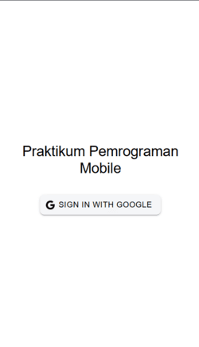
  
   - Aplikasi akan memungkinkan pengguna untuk masuk menggunakan akun Google mereka. Pada halaman login (`LoginPage.vue`), terdapat tombol yang memicu metode `loginWithGoogle` pada `authStore` saat diklik untuk melakukan login menggunakan Google.

   - Metode `loginWithGoogle` ini didefinisikan di dalam `authStore`, yang merupakan store untuk menangani status autentikasi pengguna. Pada metode ini, aplikasi akan meminta pengguna untuk login menggunakan akun Google mereka melalui Firebase.

      a. `signInWithPopup(auth, provider)` adalah fungsi Firebase untuk memunculkan jendela popup yang meminta pengguna untuk login menggunakan akun Google mereka. Fungsi ini mengembalikan objek yang berisi informasi pengguna yang sudah login.

      b. Setelah login berhasil, data pengguna seperti displayName, email, dan foto profil akan disimpan dalam `authStore`.

3. Menangani State Pengguna dengan authStore

   
   
   - Setelah login berhasil, data pengguna (seperti username, email, dan foto) akan disimpan dalam `authStore`. Store ini bertanggung jawab untuk menyimpan status autentikasi pengguna (apakah pengguna sudah login atau belum) dan data terkait.

   - Setelah pengguna login, aplikasi dapat mengakses informasi pengguna seperti nama, email, dan foto profil dari `authStore`.

4. Menampilkan Profil Pengguna

   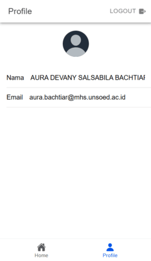

   - Pada halaman profil (`ProfilePage.vue`), data pengguna yang telah disimpan di `authStore` akan ditampilkan, termasuk foto profil. Di sini juga memastikan foto profil pengguna tampil dengan menggunakan `ion-avatar`. Jika gambar profil gagal dimuat, kita akan menampilkan gambar default.

   - Pada `ProfilePage.vue`, data yang ditampilkan adalah `displayName` dan `email` dari objek `user` yang disimpan di `authStore`. Foto profil pengguna diambil dari `photoURL` yang disediakan oleh Firebase Authentication.

5. Guard untuk Halaman yang Memerlukan Autentikasi

   Agar halaman tertentu hanya bisa diakses oleh pengguna yang sudah login, menggunakan route guard di `router/index.ts`. Pada bagian ini, aplikasi memeriksa apakah pengguna sudah login atau belum sebelum mengakses halaman tertentu.

   Pada guard ini :
   
   - Jika pengguna belum login, aplikasi akan menunggu hingga status autentikasi pengguna selesai diperiksa menggunakan `onAuthStateChanged`.
   
   - Jika pengguna sudah login, mereka akan diarahkan ke halaman utama (`/home`).
   
   - Jika pengguna tidak terautentikasi dan mencoba mengakses halaman yang memerlukan autentikasi (`isAuth: true`), mereka akan diarahkan kembali ke halaman login.

6. Logout

   Untuk logout, Anda cukup memanggil `signOut` dari Firebase, yang akan menghapus sesi pengguna dan mengembalikan status ke keadaan semula.

### Alur Lengkap
1. Pengguna membuka aplikasi dan diarahkan ke halaman login (`LoginPage.vue`).
2. Pengguna mengklik tombol "Sign In with Google", yang akan memicu `loginWithGoogle` di `authStore`.
3. Fungsi `loginWithGoogle` membuka jendela popup untuk login menggunakan Google. Setelah login berhasil, Firebase mengembalikan objek pengguna yang berisi informasi seperti `displayName`, `email`, dan `photoURL`.
4. Data pengguna disimpan di `authStore`.
5. Halaman profil (`ProfilePage.vue`) akan menampilkan data pengguna yang disimpan di `authStore`, seperti nama, email, dan foto profil.
6. Jika pengguna sudah login, mereka dapat mengakses halaman yang dilindungi, seperti halaman profil. Jika belum login, mereka akan diarahkan ke halaman login.
7. Pengguna dapat logout, yang akan menghapus sesi autentikasi dan mengarahkan mereka kembali ke halaman login.

# Tugas 10 - Pertemuan 11

## Penjelasan Proses CRUD.

1. Proses Create (Tambah Data)
   
   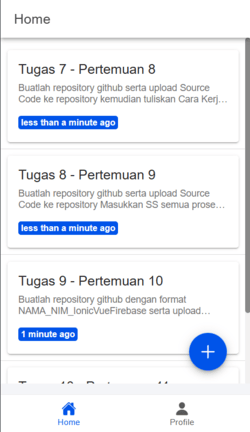
   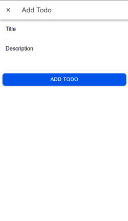
   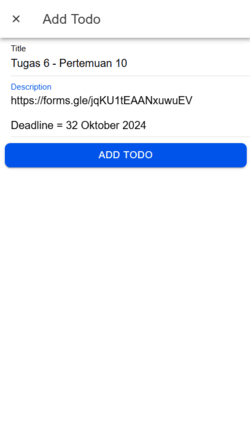
   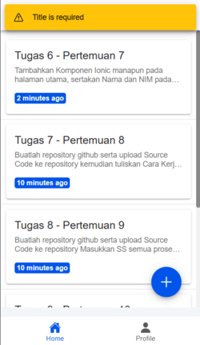
   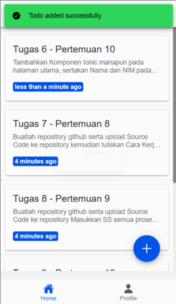

   - Komponen yang Terlibat : `InputModal.vue` (Komponen modal yang digunakan untuk memasukkan data baru atau mengedit data yang sudah ada). `HomePage.vue` (Halaman utama yang menampilkan daftar todos dan memicu modal untuk menambah atau mengedit todos). `firestore.ts` (Layanan yang mengelola interaksi dengan Firestore, termasuk operasi Create).
     
   - Alur Proses
     
     - Di `HomePage.vue`, terdapat tombol Floating Action Button (FAB) yang ketika diklik akan membuka modal untuk menambah todo baru.
       
     - Modal ditampilkan menggunakan komponen `InputModal.vue` yang menerima props `isOpen`, `editingId`, dan `todo`.
       
     - Di `InputModal.vue`, pengguna mengisi judul dan deskripsi todo.
       
     - Ketika pengguna mengklik tombol "Add Todo", fungsi input dipanggil yang kemudian mengemisi event submit dengan data todo yang diisi.
       
     - Fungsi `handleSubmit` di `HomePage.vue` menerima data todo dan memanggil layanan Firestore untuk menambah data ke database.
       
     - Fungsi `addTodo` di `firestore.ts` menambahkan dokumen baru ke koleksi `todos` di Firestore.
       
     - Setelah berhasil menambah todo, pengguna menerima notifikasi sukses melalui toast.
       
 - Penanganan Kesalahan
  
     - Jika terjadi error saat menambah todo, aplikasi akan menampilkan toast dengan pesan error.

 - Ilustrasi Proses Create
     - Tampilan Awal: Pengguna melihat daftar todos dengan tombol tambah di pojok kanan bawah.
  
     - Pengguna Klik Tambah: Modal muncul dengan form untuk memasukkan judul dan deskripsi todo.
  
     - Pengguna Isi Form: Pengguna mengisi informasi dan mengklik tombol "Add Todo".
  
     - Proses Tambah Data: Data dikirim ke Firestore dan ditambahkan ke database.
  
     - Feedback: Pengguna melihat toast yang menyatakan bahwa todo berhasil ditambahkan.
  
     - Tampilan Terbaru: Daftar todos diperbarui dengan todo baru yang ditambahkan.

2. Proses Read (Baca Data)

   

   - Komponen yang Terlibat
     
     - `HomePage.vue`: Komponen utama yang menampilkan daftar todos dengan menggunakan data yang diambil dari Firestore.
       
     - `firestore.ts`: Layanan yang mengelola interaksi dengan Firestore, termasuk operasi Read.
       
   - Alur Proses
     - Ketika `HomePage.vue` dimuat, fungsi `loadTodos` dipanggil dalam lifecycle hook `onMounted` untuk mengambil data todos dari Firestore.
     
     - Fungsi `getTodos` di `firestore.ts` mengambil semua dokumen dari koleksi `todos` yang dimiliki oleh pengguna yang sedang login.
     
     - Data yang diambil disimpan dalam reactive variable `todos` dan dipisahkan menjadi `activeTodos` dan `completedTodos` menggunakan computed properties.
     
     - `HomePage.vue` menggunakan loop `v-for` untuk menampilkan setiap todo dalam daftar aktif dan selesai.
       
   - Pembaruan Data Secara Real-Time
     
     - Dengan menggunakan Firestore, data dapat diperbarui secara real-time jika terdapat perubahan pada database.
     
     - Namun, dalam kode ini, data di-refresh setiap menit menggunakan `setInterval` untuk memperbarui waktu relatif.
       
   - Ilustrasi Proses Read
     - Tampilan Awal: Pengguna membuka aplikasi dan melihat daftar todos yang sudah ada.
     
     - Pengambilan Data: Aplikasi mengambil data todos dari Firestore saat komponen dimuat.
     
     - Rendering Data: Todos ditampilkan di UI, dibedakan antara aktif dan selesai.
     
     - Pembaruan Waktu: Waktu relatif pada setiap todo diperbarui setiap menit tanpa perlu refresh manual.

3. Proses Update (Edit Data)

   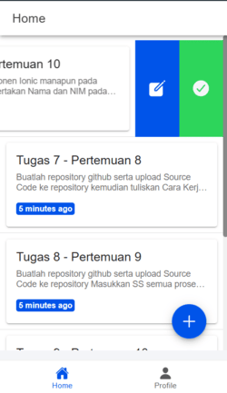
   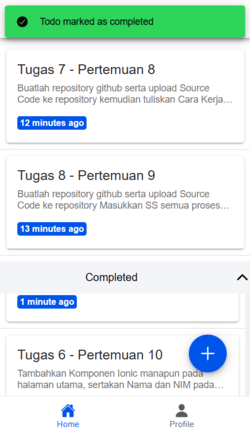
   
   
   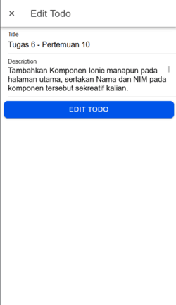
   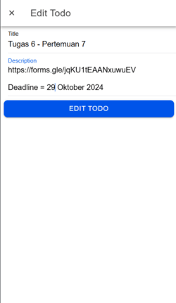
   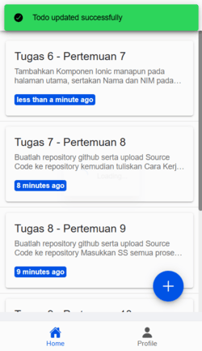

   - Komponen yang Terlibat
     
     - `InputModal.vue`: Komponen modal yang digunakan untuk mengedit todo yang sudah ada.
       
     - `HomePage.vue`: Halaman utama yang menampilkan daftar todos dan memicu modal untuk mengedit todos.
       
     - `firestore.ts`: Layanan yang mengelola interaksi dengan Firestore, termasuk operasi Update.
       
   - Alur Proses
     - Di `HomePage.vue`, setiap item todo memiliki opsi untuk mengedit yang ketika dipilih akan membuka modal dengan data todo yang sudah ada.
     
     - Fungsi `handleEdit` di `HomePage.vue` mengatur `editingId` dan `todo` yang akan diedit, kemudian membuka modal.
     
     - Di `InputModal.vue`, data todo yang dipilih diisi ke dalam form sehingga pengguna dapat mengeditnya.
     
     - Ketika pengguna mengklik tombol "Edit Todo", event submit dikirim dengan data yang sudah diubah. Fungsi `handleSubmit` di `HomePage.vue` menangani pengiriman ini dan memanggil fungsi `updateTodo` dari Firestore.
       
     - Fungsi `updateTodo` di `firestore.ts` memperbarui dokumen yang sudah ada dengan data baru.
       
     - Setelah berhasil memperbarui todo, pengguna menerima notifikasi sukses melalui toast.
       
   - Penanganan Kesalahan
     
     - Jika terjadi error saat memperbarui todo, aplikasi akan menampilkan toast dengan pesan error.
       
   - Ilustrasi Proses Read
     - Tampilan Awal: Pengguna melihat daftar todos dengan opsi untuk mengedit di setiap item.
     
     - Pengguna Klik Edit: Pengguna memilih opsi edit pada todo tertentu, membuka modal dengan data yang sudah ada.
     
     - Pengguna Ubah Data: Pengguna mengubah judul atau deskripsi todo dan mengklik tombol "Edit Todo".
     
     - Proses Update Data: Data yang diubah dikirim ke Firestore untuk memperbarui dokumen yang sesuai.
       
     - Feedback: Pengguna melihat toast yang menyatakan bahwa todo berhasil diperbarui.
     
     - Tampilan Terbaru: Daftar todos diperbarui dengan perubahan yang telah dilakukan.
   
4. Proses Delete (Hapus Data)

   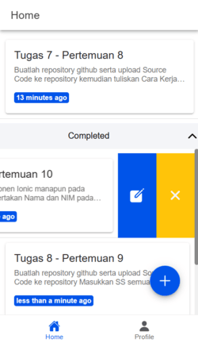

   - Komponen yang Terlibat
       
     - `HomePage.vue`: Halaman utama yang menampilkan daftar todos dan menyediakan opsi untuk menghapus todos.
       
     - `firestore.ts`: Layanan yang mengelola interaksi dengan Firestore, termasuk operasi Delete.
       
   - Alur Proses
     - Di `HomePage.vue`,setiap item todo memiliki opsi untuk menghapus yang ketika dipilih akan memicu fungsi `handleDelete`.
     
     - Biasanya, aplikasi akan meminta konfirmasi sebelum menghapus data untuk mencegah penghapusan tidak sengaja. Dalam kode ini, konfirmasi tersebut bisa ditambahkan untuk meningkatkan user experience. Namun, dalam implementasi saat ini, penghapusan langsung dilakukan saat opsi dipilih tanpa konfirmasi.
     
     - Fungsi `handleDelete` di `HomePage.vue` memanggil layanan Firestore untuk menghapus todo berdasarkan `id`.
     
     - Fungsi `deleteTodo` di `firestore.ts` menghapus dokumen dari koleksi `todos` berdasarkan `id`.
       
     - Setelah berhasil menghapus todo, pengguna menerima notifikasi sukses melalui toast.
       
     - Setelah penghapusan, fungsi `loadTodos` dipanggil kembali untuk memperbarui daftar todos yang ditampilkan.
       
   - Penanganan Kesalahan
     
     - Jika terjadi error saat menghapus todo, aplikasi akan menampilkan toast dengan pesan error.
       
   - Ilustrasi Proses Delete
     - Tampilan Awal: Pengguna melihat daftar todos dengan opsi untuk menghapus di setiap item.
     
     - Pengguna Klik Hapus: Pengguna memilih opsi hapus pada todo tertentu.
     
     - Proses Hapus Data: Permintaan hapus dikirim ke Firestore untuk menghapus dokumen yang sesuai.
     
     - Feedback: Pengguna melihat toast yang menyatakan bahwa todo berhasil dihapus.
       
     - Tampilan Terbaru: Daftar todos diperbarui tanpa todo yang dihapus.

## Build Ionic ke bentuk Apk
