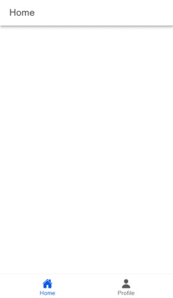

# Tugas 9 - Pertemuan 10

Nama : Aura Devany Salsabila Bachtiar

NIM : H1D022015

Shift Baru: Shift C

## Jelaskan bagaimana cara dari mulai autentikasi login, hingga aplikasi mendapatkan username dan profil kita dari akun google.

1. Setup Firebase dan Google Auth Provider

   - Mengonfigurasi Firebase.

     Firebase akan diinisialisasi pada berkas seperti utils/firebase.ts. Pastikan Firebase sudah diinisialisasi dan mengimpor auth dari Firebase untuk menangani autentikasi.

2. Login dengan Google

   
  
   - Aplikasi akan memungkinkan pengguna untuk masuk menggunakan akun Google mereka. Pada halaman login (`LoginPage.vue`), terdapat tombol yang memicu metode `loginWithGoogle` pada `authStore` saat diklik untuk melakukan login menggunakan Google.

   - Metode `loginWithGoogle` ini didefinisikan di dalam `authStore`, yang merupakan store untuk menangani status autentikasi pengguna. Pada metode ini, aplikasi akan meminta pengguna untuk login menggunakan akun Google mereka melalui Firebase.

      a. `signInWithPopup(auth, provider)` adalah fungsi Firebase untuk memunculkan jendela popup yang meminta pengguna untuk login menggunakan akun Google mereka. Fungsi ini mengembalikan objek yang berisi informasi pengguna yang sudah login.

      b. Setelah login berhasil, data pengguna seperti displayName, email, dan foto profil akan disimpan dalam `authStore`.

3. Menangani State Pengguna dengan authStore

   
   
   - Setelah login berhasil, data pengguna (seperti username, email, dan foto) akan disimpan dalam `authStore`. Store ini bertanggung jawab untuk menyimpan status autentikasi pengguna (apakah pengguna sudah login atau belum) dan data terkait.

   - Setelah pengguna login, aplikasi dapat mengakses informasi pengguna seperti nama, email, dan foto profil dari `authStore`.

4. Menampilkan Profil Pengguna

   

   - Pada halaman profil (`ProfilePage.vue`), data pengguna yang telah disimpan di `authStore` akan ditampilkan, termasuk foto profil. Di sini juga memastikan foto profil pengguna tampil dengan menggunakan `ion-avatar`. Jika gambar profil gagal dimuat, kita akan menampilkan gambar default.

   - Pada `ProfilePage.vue`, data yang ditampilkan adalah `displayName` dan `email` dari objek `user` yang disimpan di `authStore`. Foto profil pengguna diambil dari `photoURL` yang disediakan oleh Firebase Authentication.

5. Guard untuk Halaman yang Memerlukan Autentikasi

   Agar halaman tertentu hanya bisa diakses oleh pengguna yang sudah login, menggunakan route guard di `router/index.ts`. Pada bagian ini, aplikasi memeriksa apakah pengguna sudah login atau belum sebelum mengakses halaman tertentu.

   Pada guard ini :
   
   - Jika pengguna belum login, aplikasi akan menunggu hingga status autentikasi pengguna selesai diperiksa menggunakan `onAuthStateChanged`.
   
   - Jika pengguna sudah login, mereka akan diarahkan ke halaman utama (`/home`).
   
   - Jika pengguna tidak terautentikasi dan mencoba mengakses halaman yang memerlukan autentikasi (`isAuth: true`), mereka akan diarahkan kembali ke halaman login.

6. Logout

   Untuk logout, Anda cukup memanggil `signOut` dari Firebase, yang akan menghapus sesi pengguna dan mengembalikan status ke keadaan semula.

### Alur Lengkap
1. Pengguna membuka aplikasi dan diarahkan ke halaman login (`LoginPage.vue`).
2. Pengguna mengklik tombol "Sign In with Google", yang akan memicu `loginWithGoogle` di `authStore`.
3. Fungsi `loginWithGoogle` membuka jendela popup untuk login menggunakan Google. Setelah login berhasil, Firebase mengembalikan objek pengguna yang berisi informasi seperti `displayName`, `email`, dan `photoURL`.
4. Data pengguna disimpan di `authStore`.
5. Halaman profil (`ProfilePage.vue`) akan menampilkan data pengguna yang disimpan di `authStore`, seperti nama, email, dan foto profil.
6. Jika pengguna sudah login, mereka dapat mengakses halaman yang dilindungi, seperti halaman profil. Jika belum login, mereka akan diarahkan ke halaman login.
7. Pengguna dapat logout, yang akan menghapus sesi autentikasi dan mengarahkan mereka kembali ke halaman login.
